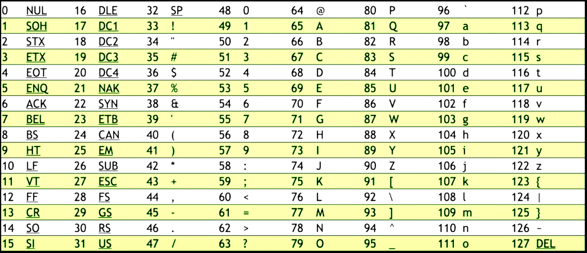
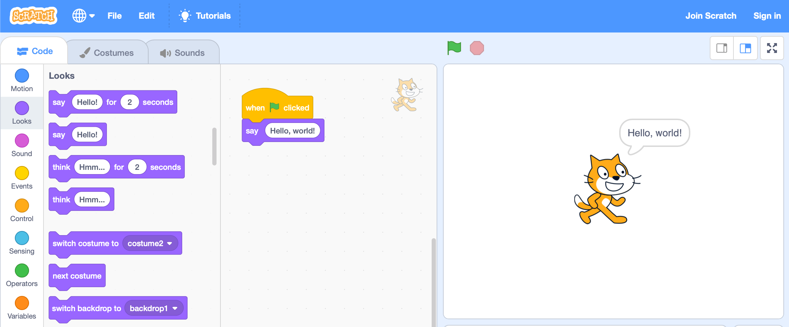
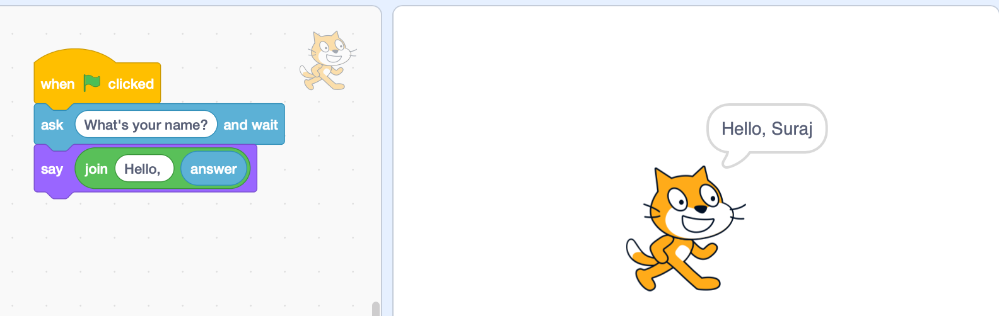
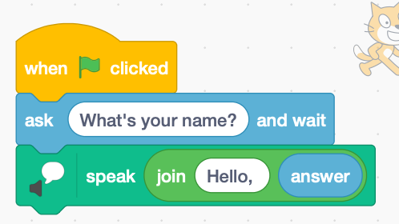
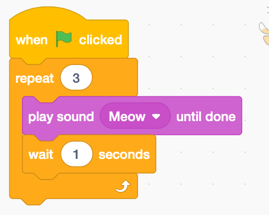
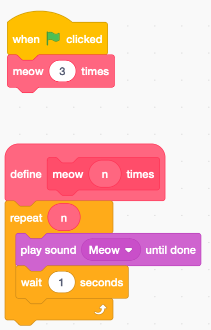
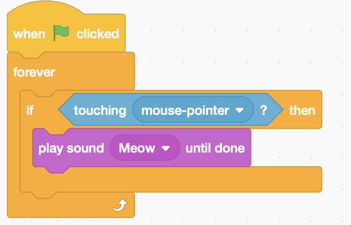
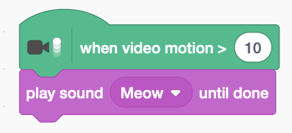

# Week 0: Scratch

<details>
<summary> What is Computer Science? </summary>

Input → $\square$ → Output

Using computers to solve problems
</details>

## Binary

**Computers speak in binary - 0s and 1s**

0 - no electricity pass through transistors (a switch)

1 - pass electricity through transistors (a switch)

<span style="color:red"> Binary to Decimal Formula: </span>
*Considering* $d_n$ *to be the digits of a binary number consisting of `n` digts*

*Decimal Number* = $(d_0 * 2^0) + (d_1 * 2^1) + (d_2 * 2^2) + ... + (d_{n-1} * 2^{n-1})$
*where* $d_0, d_1, d_2$ *are the individual digits of the binary number starting from the right most position*

In this case, since we have 3 bits: $(d_2 * 2^2) + (d_1 * 2^1) + (d_0 * 2^0)$

| Binary Notion | Decimal Notion |
| --- | --- |
| 000 | 0 |
| 001 | 1 |
| 010 | 2 |
| 011 | 3 |
| 100 | 4 |
| 101 | 5 |
| 110 | 6 |
| 111 | 7 |

How do we get to 8? We are out of bits. The above only has 3 bits.

<details>
<summary> How do we represent letters? Uppercase, Lowercase, Symbols? </summary>

- ASCII - American Standard Code for Information Interchange
    
    A = 65 (ASCII) = 01000001
    
    ex: HI!
    
    | ASCII | Decimal | Binary |
    | --- | --- | --- |
    | H | 72 | 01001000 |
    | I | 73 | 01001001 |
    | ! | 33 | 00100001 |
    
    

    ASCII Chart
   
</details>

Byte - 8 bits

- How high can we count up to with 8 bits?
    
    256, technically 255 (0-255)
    

Unicode - 8 or 16 or 32 bits

- superset of ASCII
- Emoji uses Unicode

How do we represent colors?

RGB

## Algorithms

- What is an algorithm?
    
    Step-by-step instructions for solving some problem
    

### Pseudocode

ex: Phonebook pseudocode - find specific person name

| Syntax | pseudonames |
| --- | --- |
| Functions | Pick up, Open to, Look at, Call, Quit|
| Conditionals | If, Else if, Else |
| Boolean Expressions (Named after Mathematician Bool) | is |
| Loops | Go back |

```
Pick up phone book
Open to middle of phone book
Look at page
If person is on page
	Call person
Else if person is earlier in book
	Open to middle of left half of book
	Go back to line 3
Else if person is later in book
	Open to middle of right half of book
	Go back to line 3
Else
	Quit
```

## Scratch
[**Scratch**](https://scratch.mit.edu/)
- Example 1: Hello World
    
    `Hello, World`! in Scratch:
    
    
    
- Example 2: Request Input from User
    
    Adding a function to request input from User
    
    
    
    Using AWS text-to-speech in Scratch
    
    
    
- Example 3: Loops
    
    
    
- Example 4: Creating our own functions (Meow in Scratch)
    
    
    
- Example 5: Conditionals & Video Sensing
    
    
    
    
    

## Problem Set 0
- [CS50: Problem Set 0](https://cs50.harvard.edu/x/2022/psets/0/)

- [Problem Set 0: Submission](Feed_the_Hippo.sb3)
